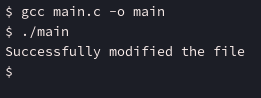

# aspz-p8

## Навігація по README.md:

- [Завдання за варіантом](#завдання-за-варіантом-3)

## Завдання за варіантом №3

Створіть програму, яка змінює вміст відкритого файлу без переміщення вказівника позиції читання/запису.

З назви теми: "Системні виклики в UNIX/POSIX (файлові операції, fork(), qsort(), write(), read(), lseek() тощо", так розумію, що функцію POSIX дозволені - тому буду використовувати pwrite для цього завдання.

Написав наступний код - [main.c](./main.c)

```c
#include <stdio.h>
#include <stdlib.h>
#include <string.h>
#include <unistd.h>
#include <fcntl.h>

int main() {
    int FD = open("test.txt", O_RDWR);

    if (FD < 0) {
        perror("Error: opening the file failed");
        return 1;
    }

    const char *replacement = "Hello,World";
    if (pwrite(FD, replacement, strlen(replacement), 6) < 0) {
        perror("Error: pwrite failed to execute");

        close(FD);
        return 1;
    }

    printf("Successfully modified the file\n");

    close(FD);
    return 0;
}
```

Програма відкриває файл, і на шостому байті запише "Hello,World", замість того, що було на тому місці.

Маю файл [test.txt](./test.txt) з таким вмістом:

```
12345
67890
ABCDE
abcde
yuiop
YUIOP
```

Давайте запустимо програму:



Програма вдало завершилась. Відкриємо знову файл [test.txt](./test.txt):

```
12345
Hello,World
abcde
yuiop
YUIOP
```

Як бачимо, на шостому байті (на місці шестірки), програма записала "Hello,World".

Так як довжина стрічки 11 букв, то відповідно 67890, \n, і ABCDE зникли з файлу.