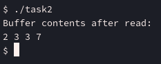

# aspz-p8

## Навігація по README.md:

- [Завдання 8.1](#завдання-81)
- [Завдання 8.2](#завдання-82)
- [Завдання 8.3](#завдання-83)
- [Завдання 8.4](#завдання-84)
- [Завдання за варіантом](#завдання-за-варіантом-3)

## Завдання 8.1

     Чи може виклик count = write(fd, buffer, nbytes); повернути в змінній count значення, відмінне від nbytes? Якщо так, то чому? Наведіть робочий приклад програми, яка демонструє вашу відповідь.

З документації про функцію write, можна дізнатись, що write вертає значення відмінне від nbytes, у наступних випадках:

- ```0```, коли write дійшов до кінця файлу
- ```-1```, при помилці запису або через сигнал системи.

Але! Адже write вертає кількість байтів які він успішно записав, а не просто вертає аргумент nbytes, інколи навіть не в окремих випадках як ```0``` і ```-1``` write може вернути число, відмінне від nbytes. Найпростіший приклад - це використати pipe.

Написав наступний код - [task1.c](./task1.c)

```c
#include <stdio.h>
#include <stdlib.h>
#include <unistd.h>
#include <fcntl.h>
#include <string.h>
#include <errno.h>

#define WORKING_SIZE 65536
#define BROKEN_SIZE 65537

void pipe_check(int bfr_size);

int main() {
    pipe_check(WORKING_SIZE);
    pipe_check(BROKEN_SIZE);

    return 0;
}

void pipe_check(int bfr_size) {
    int pipefd[2];

    if (pipe(pipefd) == -1) {
        perror("pipe");
        exit(EXIT_FAILURE);
    }

    int flags = fcntl(pipefd[1], F_GETFL, 0);
    if (flags == -1) {
        perror("fcntl F_GETFL");
        exit(EXIT_FAILURE);
    }
    if (fcntl(pipefd[1], F_SETFL, flags | O_NONBLOCK) == -1) {
        perror("fcntl F_SETFL");
        exit(EXIT_FAILURE);
    }

    char buffer[bfr_size];
    memset(buffer, 'A', sizeof(buffer));

    ssize_t total_written = 0;
    ssize_t count;

    while (total_written < sizeof(buffer)) {
        count = write(pipefd[1], buffer + total_written, sizeof(buffer) - total_written);

        if (count == -1) {
            perror("write error");
            break;
        } else {
            printf("Attempted to write %zu bytes, actually wrote %zd bytes\n",
                   sizeof(buffer) - total_written, count);
            total_written += count;
        }
    }

    close(pipefd[0]);
    close(pipefd[1]);
}
```

Код створить pipe з буфером на 64КБ і 64КБ + 1 байт, і для обох спробує зробити запис через write. Робимо обидві pipe NON-BLOCKING аби програма спробувала одразу записати дані і не чекати.

Результат: 


Дійсно бачимо - бувають випадки, де повернене значення відмінне від nbytes.

## Завдання 8.2

     Є файл, дескриптор якого — fd. Файл містить таку послідовність байтів: 4, 5, 2, 2, 3, 3, 7, 9, 1, 5. У програмі виконується наступна послідовність системних викликів:

    lseek(fd, 3, SEEK_SET);
    
    read(fd, &buffer, 4);
    
    де виклик lseek переміщує покажчик на третій байт файлу. Що буде містити буфер після завершення виклику read? Наведіть робочий приклад програми, яка демонструє вашу відповідь.

Репрезентуємо файл наступним чином:

```py
0 1 2 3 4 5 6 7 8 9
4 5 2 2 3 3 7 9 1 5
```

Перший рядок - індекс байтів.
Другий - вміст.

Тепер, логічно подумаємо. Якщо змістити seek до 3 байту (друге число 2), і прочитати 4 байти, в теорії ми повинні отримати результат ```[2, 3, 3, 7]```.

Написав наступний код - [task2.c](./task2.c)

```c
#include <stdio.h>
#include <stdlib.h>
#include <unistd.h>
#include <fcntl.h>

int main() {

    const char *filename = "testfile.bin";

    unsigned char data[] = {4, 5, 2, 2, 3, 3, 7, 9, 1, 5};
    unsigned char buffer[4];

    int fd;
    fd = open(filename, O_WRONLY | O_CREAT | O_TRUNC, 0644);
    
    if (fd == -1) {
        perror("open for writing");
        exit(EXIT_FAILURE);
    }

    if (write(fd, data, sizeof(data)) != sizeof(data)) {
        perror("write");
        exit(EXIT_FAILURE);
    }
    close(fd);

    fd = open(filename, O_RDONLY);
    if (fd == -1) {
        perror("open for reading");
        exit(EXIT_FAILURE);
    }

    if (lseek(fd, 3, SEEK_SET) == -1) {
        perror("lseek");
        exit(EXIT_FAILURE);
    }

    ssize_t bytesRead = read(fd, buffer, sizeof(buffer));
    if (bytesRead == -1) {
        perror("read");
        exit(EXIT_FAILURE);
    }

    printf("Buffer contents after read:\n");
    for (int i = 0; i < bytesRead; i++) {
        printf("%d ", buffer[i]);
    }
    printf("\n");

    close(fd);

    return 0;
}
```

Подивимось на практиці:



Усе працює, як ми і думали.

## Завдання 8.3

     Бібліотечна функція qsort призначена для сортування даних будь-якого типу. Для її роботи необхідно підготувати функцію порівняння, яка викликається з qsort кожного разу, коли потрібно порівняти два значення.

    Оскільки значення можуть мати будь-який тип, у функцію порівняння передаються два вказівники типу void* на елементи, що порівнюються.
    
    - Напишіть програму, яка досліджує, які вхідні дані є найгіршими для алгоритму швидкого сортування. Спробуйте знайти кілька масивів даних, які змушують qsort працювати якнайповільніше. Автоматизуйте процес експериментування так, щоб підбір і аналіз вхідних даних виконувалися самостійно.

    - Придумайте і реалізуйте набір тестів для перевірки правильності функції qsort.

qsort - quicksort, сортує залежно від pivot point - середина списку. Якщо цей pivot point буде найменшим або найбільшим елемент у всьому списку, то це і є найгіршим випадку для quicksort'у.

Також, після виконання програми, маємо функцію яка перевіряє правильність сортування.

Написав наступну програму - [task3.c](./task3.c)

```c
#include <stdio.h>
#include <stdlib.h>
#include <string.h>
#include <time.h>

#define ARRAY_SIZE 10000

int compare_ints(const void *a, const void *b) {
    int arg1 = *(const int *)a;
    int arg2 = *(const int *)b;

    if (arg1 < arg2) return -1;
    if (arg1 > arg2) return 1;
    return 0;
}

int is_sorted(int *array, size_t size) {
    for (size_t i = 1; i < size; i++) {
        if (array[i-1] > array[i]) {
            return 0;
        }
    }
    return 1;
}

void fill_sorted(int *array, size_t size) {
    for (size_t i = 0; i < size; i++) {
        array[i] = (int)i;
    }
}

void fill_reverse_sorted(int *array, size_t size) {
    for (size_t i = 0; i < size; i++) {
        array[i] = (int)(size - i);
    }
}

void fill_random(int *array, size_t size) {
    for (size_t i = 0; i < size; i++) {
        array[i] = rand();
    }
}

void test_case(const char *description, void (*fill_func)(int *, size_t)) {
    int *array = malloc(ARRAY_SIZE * sizeof(int));
    if (!array) {
        perror("malloc");
        exit(EXIT_FAILURE);
    }

    fill_func(array, ARRAY_SIZE);

    clock_t start = clock();
    qsort(array, ARRAY_SIZE, sizeof(int), compare_ints);
    clock_t end = clock();

    double duration = (double)(end - start) / CLOCKS_PER_SEC;

    printf("%s:\n", description);
    printf("  Time taken: %.6f seconds\n", duration);

    if (is_sorted(array, ARRAY_SIZE)) {
        printf("  Array is sorted correctly!\n");
    } else {
        printf("  Sorting failed!\n");
    }

    printf("\n");

    free(array);
}

int main() {
    srand((unsigned int)time(NULL));

    test_case("Sorted array", fill_sorted);
    test_case("Reverse sorted array", fill_reverse_sorted);
    test_case("Random array", fill_random);

    return 0;
}
```

Запустимо програму:


Як бачимо, це дійсно так.

## Завдання 8.4

     Виконайте наступну програму на мові програмування С:
```c
int main() {
int pid;
pid = fork();
printf("%d\n", pid);
}
```
    Завершіть цю програму. Припускаючи, що виклик fork() був успішним, яким може бути результат виконання цієї програми?


Функція fork() викликає копію поточного процесу, з того моменту, де зробили копію. 

Тобто, після виклику fork(), єдине що child процес виконає, це:

```c
printf("%d\n", pid);
```

Звідси, можемо сказати, що вивід програми повинен бути такий - вивестись PID parent процесу, і 0 - число, яке вертає fork() для child процесів.

Виправлю програму, і запущу її - [task4.c](./task4.c)

```c
#include <stdio.h>
#include <unistd.h>

int main() {
    int pid;
    pid = fork();
    printf("%d\n", pid);
    return 0;
}
```


## Завдання за варіантом №3

    Створіть програму, яка змінює вміст відкритого файлу без переміщення вказівника позиції читання/запису.

З назви теми: "Системні виклики в UNIX/POSIX (файлові операції, fork(), qsort(), write(), read(), lseek() тощо", так розумію, що функцію POSIX дозволені - тому буду використовувати pwrite для цього завдання.

Написав наступний код - [main.c](./main.c)

```c
#include <stdio.h>
#include <stdlib.h>
#include <string.h>
#include <unistd.h>
#include <fcntl.h>

int main() {
    int FD = open("test.txt", O_RDWR);

    if (FD < 0) {
        perror("Error: opening the file failed");
        return 1;
    }

    const char *replacement = "Hello,World";
    if (pwrite(FD, replacement, strlen(replacement), 6) < 0) {
        perror("Error: pwrite failed to execute");

        close(FD);
        return 1;
    }

    printf("Successfully modified the file\n");

    close(FD);
    return 0;
}
```

Програма відкриває файл, і на шостому байті запише "Hello,World", замість того, що було на тому місці.

Маю файл [test.txt](./test.txt) з таким вмістом:

```
12345
67890
ABCDE
abcde
yuiop
YUIOP
```

Давайте запустимо програму:


Програма вдало завершилась. Відкриємо знову файл [test.txt](./test.txt):

```
12345
Hello,World
abcde
yuiop
YUIOP
```

Як бачимо, на шостому байті (на місці шестірки), програма записала "Hello,World".

Так як довжина стрічки 11 букв, то відповідно 67890, \n, і ABCDE зникли з файлу.